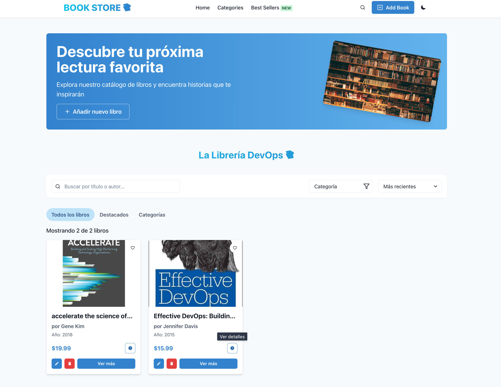

# Guía para Desplegar Book Store [Local]

Esta guía te ayudará a desplegar tu aplicación Book Store usando Docker Compose, sin necesidad de configurar autenticación en MongoDB, ideal para entornos de desarrollo local.



## Estructura Recomendada

```
bookstore/
├── frontend/           # Tu aplicación React/Vite
│   ├── Dockerfile
│   └── ...
├── backend/            # Tu API Express
│   ├── Dockerfile
│   └── ...
├── mongo/              # Scripts de inicialización para MongoDB
│   │── 00-create-user.js # Carga datos iniciales
│   └── Dockerfile      
├── compose.yml  # Configuración de servicios

```


## Despliegue

1. **Construir y ejecutar con Docker Compose**:
   ```bash
   # Construir las imágenes
   docker compose build
   
   # Iniciar los servicios
   docker compose up -d
   ```

2. **Verificar que todo funciona**:
   - Frontend: http://localhost:5173
   - Backend API: http://localhost:3333/books

## Comandos útiles

- **Ver logs**: `docker compose logs -f`
- **Detener servicios**: `docker compose down`
- **Reiniciar servicios**: `docker compose restart`
- **Reconstruir después de cambios en Dockerfile**: `docker compose up -d --build`


## Acceder a MongoDB desde fuera de Docker

Puedes conectarte a la base de datos usando cualquier cliente MongoDB como MongoDB Compass:
- URL: `mongodb://localhost:27017`
- Base de datos: `bookstore`

## Solución de problemas comunes

1. **El frontend no puede conectar con el backend**:
   - Verifica que la variable `API_BASE_URL` esté configurada correctamente
   - Asegúrate de que el backend esté funcionando (`docker compose logs backend`)

2. **El backend no puede conectar con MongoDB**:
   - Verifica la URL de conexión en el backend
   - Comprueba que MongoDB esté funcionando (`docker compose logs mongo`)

3. **Los cambios en el código no se reflejan**:
   - Para el frontend, verifica que Vite esté configurado para hot-reload
   - Para el backend, puede ser necesario reiniciar el servicio o usar nodemon